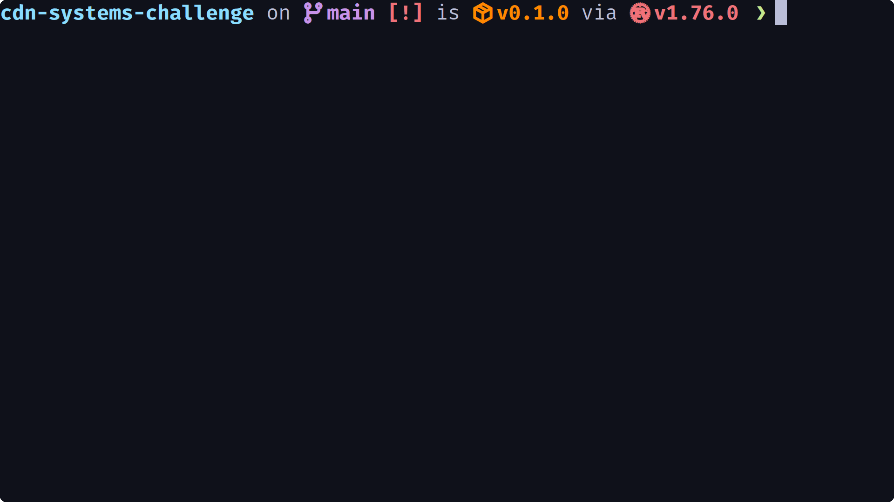

# CDN systems challenge
- There are X reparimen in a MxN world of houses
- There are a number of broken houses in the world spreaded randomly
- Each repairman is executed by a thread
- The only way of communication between repairmen is reading and writing messages in the house they occupy
- Each repairman may write their message in the same house one at a time
- A message is the number of repaired house alongside the repairman's name/ID
- The goal is to fix all of the houses in the most performant way possible without breaking the rules

## Demo


## Run
```sh
cargo run --release
```

## Build
```sh
cargo build --release
```

## Test
```sh
cargo test
```
